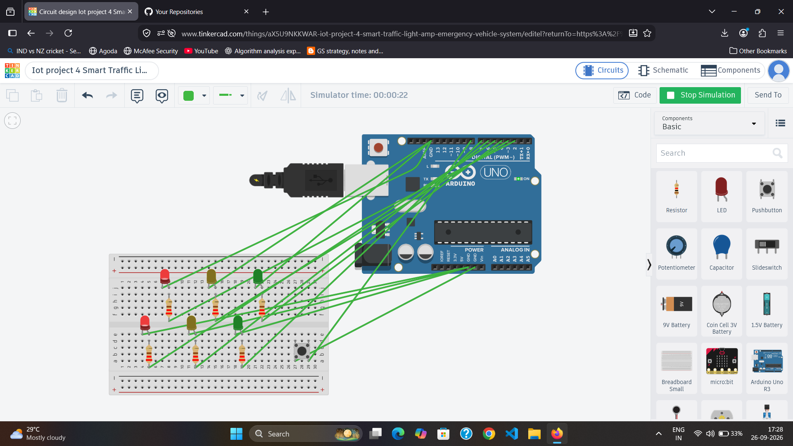

# 🚦 Smart Traffic Light & Emergency Vehicle System

An Arduino-based two-way traffic light system with an emergency vehicle priority feature using a pushbutton.

## 🎯 Objective

To design and simulate a two-way traffic light system that automatically controls traffic signals and provides an emergency mode for emergency vehicles.

## 🧩 Components

- Arduino Uno
- 6 × LEDs
  - 2 Red LEDs
  - 2 Yellow LEDs
  - 2 Green LEDs
- 6 × 220Ω Resistors
- Pushbutton
- Breadboard
- Jumper Wires

## 🔌 Circuit Connections

### Traffic Light 1

| Component | Arduino |
|---|---|
| Red LED | D2 through 220Ω |
| Yellow LED | D3 through 220Ω |
| Green LED | D4 through 220Ω |

### Traffic Light 2

| Component | Arduino |
|---|---|
| Red LED | D5 through 220Ω |
| Yellow LED | D6 through 220Ω |
| Green LED | D7 through 220Ω |

### Emergency Button

| Button Terminal | Arduino |
|---|---|
| 1A | GND |
| 2A | D8 |

The other two button terminals are left unconnected.

## ⚙️ Working

The system controls two traffic directions using red, yellow, and green LEDs.

### 🚦 Normal Traffic Mode

The signals operate in the following sequence:

**Road 1 GREEN → Road 1 YELLOW → Road 2 GREEN → Road 2 YELLOW**

Only the required signals remain ON during each phase.

### 🚑 Emergency Mode

When the emergency pushbutton is pressed:

- Both traffic directions immediately switch to **RED**
- Green and yellow LEDs turn OFF
- Both red LEDs remain ON while the button is pressed

This provides a simulated emergency priority system.

## 🔄 System Flow

**Traffic Signals + Emergency Button → Arduino → Decision Making → LED Signals**

## 🏗️ System Architecture

```text
                 ┌─────────────────────┐
                 │   Emergency Button  │
                 └──────────┬──────────┘
                            │
                            ▼
┌──────────────────────────────────────────────┐
│                  Arduino Uno                 │
│                                              │
│  Reads button input and controls traffic     │
│  signals based on the current traffic phase. │
└───────────────┬──────────────────────────────┘
                │
        ┌───────┴────────┐
        ▼                ▼
┌──────────────┐  ┌──────────────┐
│   Road 1     │  │    Road 2    │
│ R/Y/G LEDs   │  │  R/Y/G LEDs   │
└──────────────┘  └──────────────┘
This architecture demonstrates the interaction between the emergency input, Arduino controller, and two traffic signal units.
This architecture demonstrates the interaction between the emergency input, Arduino controller, and two traffic signal units.

```

## 📸 Circuit

### Normal Traffic Operation


### Emergency Mode



## 🛠️ Simulation

The project was designed and tested using **Tinkercad Circuits**.

### 🔗 Live Tinkercad Simulation

[Open the Smart Traffic Light & Emergency Vehicle System in Tinkercad](https://www.tinkercad.com/things/aX5U9NKKWAR-iot-project-4-smart-traffic-light-amp-emergency-vehicle-system)

## 💻 Technologies

- Arduino Uno
- C/C++ (Arduino)
- Digital Input/Output
- Pushbutton
- LED-based Traffic Signals
- Tinkercad Circuits

## 🧠 Concepts Learned

- Traffic light control
- Digital input and output
- Pushbutton interfacing
- `INPUT_PULLUP`
- Conditional logic
- Timing and delays
- Emergency priority handling
- Multi-LED control
- Embedded system debugging

## 🚀 Future Improvements

- Add ultrasonic sensors for vehicle detection
- Add pedestrian crossing support
- Add countdown timer using a 7-segment display
- Add an LCD/OLED display
- Add RFID or wireless emergency vehicle detection
- Upgrade the system using ESP32 for IoT connectivity

---

### 👩‍💻 Author

**Tanisha Karan**  
B.Tech CSE (IoT) Student
